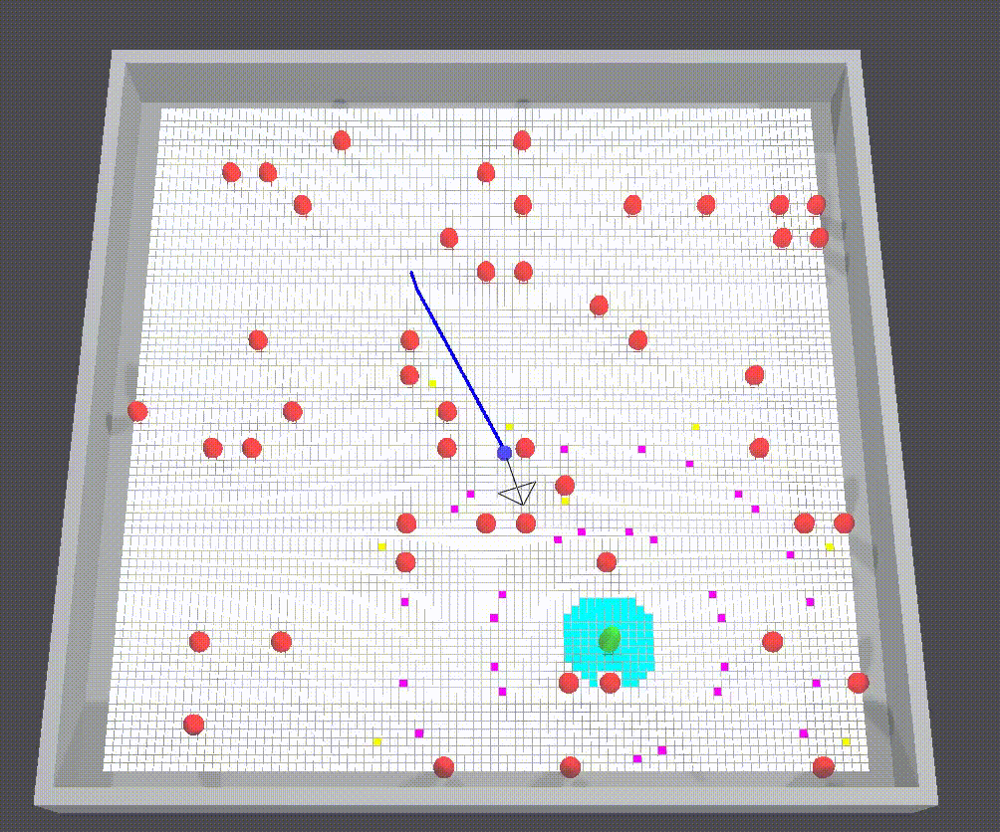

# lazyECS
Simple Entity Component System implementation with minimal robotics application examples.

This project is mainly for learning and exploration purposes. For physics (and collision) system, lazyECS utilizes ReactPhysics3D (https://github.com/DanielChappuis/reactphysics3d).

## Minimal 3D
Minimal lazyECS application with both physics and render only actors that can be moved around kinematically or dynamically.

## Potential Field
Naive implementation of the potential field algorithm where Green capsule represent the goal and Red capsules represent the obstacles. Obstacles have repulsive and goal has attractive force field attached to them, which are calculated based on Normal Distribution, where mean of the distribution is the center of the goal/obstacle location and sigma defines the propagation of the field around the object. When/how this naive implementation suffer from being stuck in local minima is quite dependent on the layout of obstacles and the sigma of the distribution.

## Wave Propagation
2D Grid based implementation of path finding by wave propagation. Compared to the potential field, implementation of this approach is more "discrete" in the sense that, the environment is divided into finite number of cells, each cell is either "occupied" or "free". There is a cost value associated with each free cell based on it's relative distance to the goal position, and the ego actor is trying to move down the cost gradient in the fastest way possible, by choosing the free cell with the lowest "cost" (distance) value in it's 4-directional neighborhood. Occupied cells omitted from the search.

